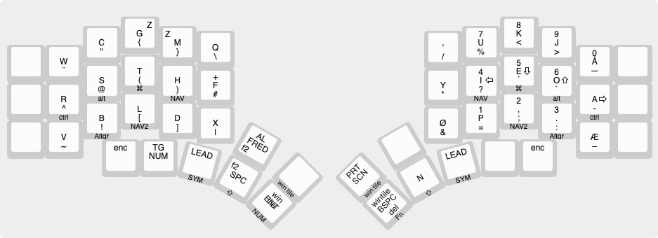

## Introduction
This is my QMK keyboard layout that is primarly used on the [Kyria Keyboard](https://splitkb.com). 
the keymap is found in the [keymap.c](https://github.com/mrkskk/qmk_firmware/tree/review/8591/keyboards/kyria/keymaps/mrkskk/keymap.c) file in the [kyria keymaps folder](https://github.com/mrkskk/qmk_firmware/tree/review/8591/keyboards/kyria/keymaps/)

