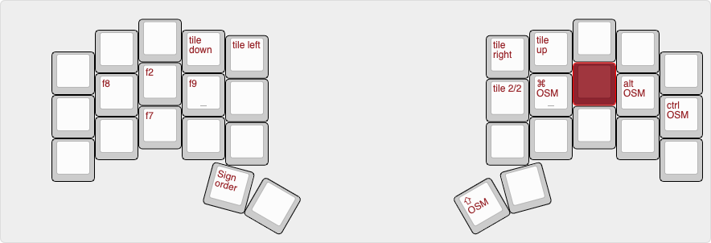

## Introduction
This is my QMK keyboard layout that is primarly used on the [Kyria Keyboard](https://splitkb.com). 
the keymap is found in the [keymap.c](https://github.com/mrkskk/qmk_firmware/tree/review/8591/keyboards/kyria/keymaps/mrkskk/keymap.c) file in the [kyria keymaps folder](https://github.com/mrkskk/qmk_firmware/tree/review/8591/keyboards/kyria/keymaps/)

the images below does not 100% match the keymap layout. will be edited to match in the future

## Base layer
this is my twist on the [Hands Down Alt-n layout](https://sites.google.com/alanreiser.com/handsdown)
is

### [Combos](combos.def)
used for: 

- For some OSM and layer toggles.  
- For the 'ø' alpha 
- For copy, paste, undo and redo 
- For uncomfortable bigrams
## Navigation layer
- With  One Shot Modifiers without timers like [Callum](https://github.com/callum-oakley/qmk_firmware/tree/master/users/callum)  

minor differences between png and actual layout
## Navigation layer 2 

## Window tiling layers
- With One Shot Modifiers without timers like [Callum](https://github.com/callum-oakley/qmk_firmware/tree/master/users/callum)
### When on MacOS

### When on Windows 10  
- Basic window tiling and shortcuts used at work

## Number layer
- LT(NUM_LAYER, space) is on left primary thumb

  
## Symbol layer
- LT(SYM_LAYER, N ) is on right primary thumb

## Mouse layer
- TG(MOUSE_LAYER) is toggled on TH combo
- LT(MOUSE_LAYER, backspace) is on right secondary thumb

## Fn layer
- LT(FN_LAYER, enter) is on left secondary thumb

## Media layer
- TG(MEDIA_LAYER) is toggled on UK combo

## adjust layer
- OSM(ADJUST_LAYER) is toggled on HI combo
- the OS toggle key switches between Windows and MacOs specific shortcuts/layers. 

