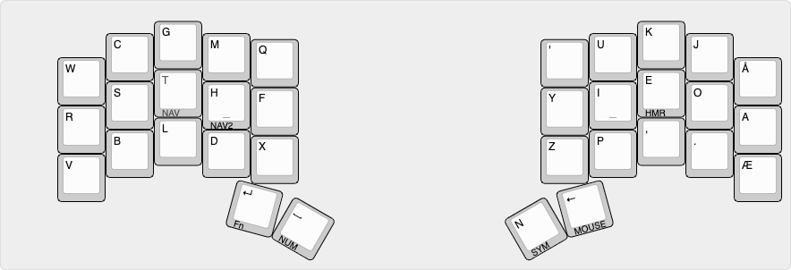
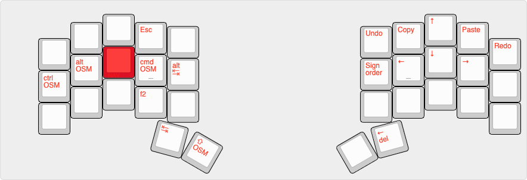
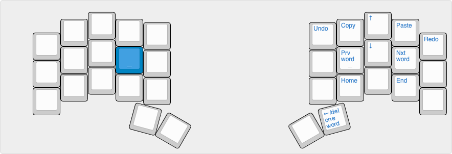
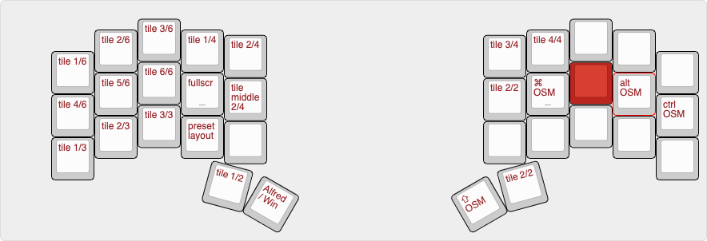
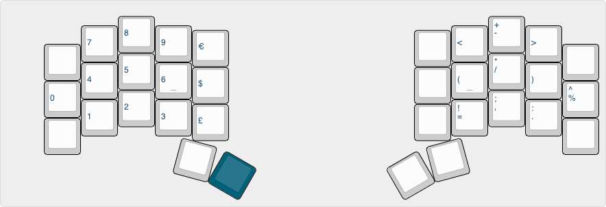
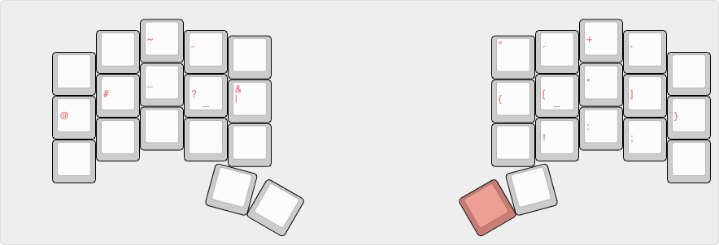
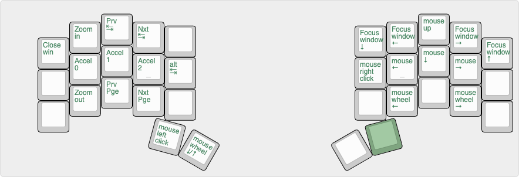
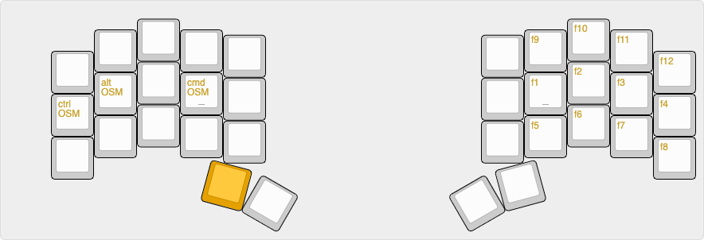
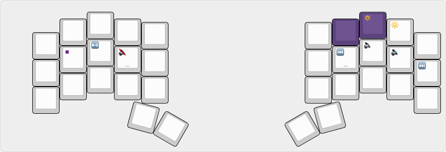
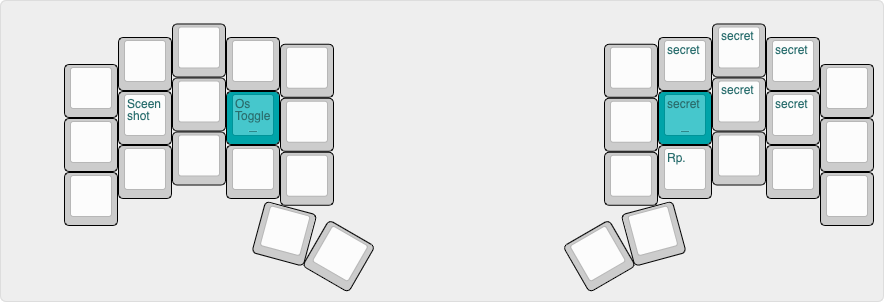

## Introduction
This is my QMK keyboard layout that is primarly used on the [Kyria Keyboard](https://splitkb.com). 
the keymap is found in the [keymap.c](https://github.com/mrkskk/qmk_firmware/tree/review/8591/keyboards/kyria/keymaps/mrkskk/keymap.c) file in the [kyria keymaps folder](https://github.com/mrkskk/qmk_firmware/tree/review/8591/keyboards/kyria/keymaps/)

## Combos

- For some OSM and layer toggles that aren't shown in the photos.  
- For the 'ø' alpha

## Base layer
this is my twist on the [Hands Down Alt-n layout](https://sites.google.com/alanreiser.com/handsdown)
is

## Navigation layer
with One Shot Modifiers without timers like [Callum](https://github.com/callum-oakley/qmk_firmware/tree/master/users/callum)  

## Navigation layer 2 

## Hammerspoon layer
For window tiling. This layer turns into a basic tiling layer when on a Windows 10 machine. 

## Number layer
  
## Symbol layer

## Mouse layer

## Fn layer

## Media layer
toggled by combo

## adjust layer
toggled by combo. OS toggle switches between Windows and MacOs specific shortcuts. 

